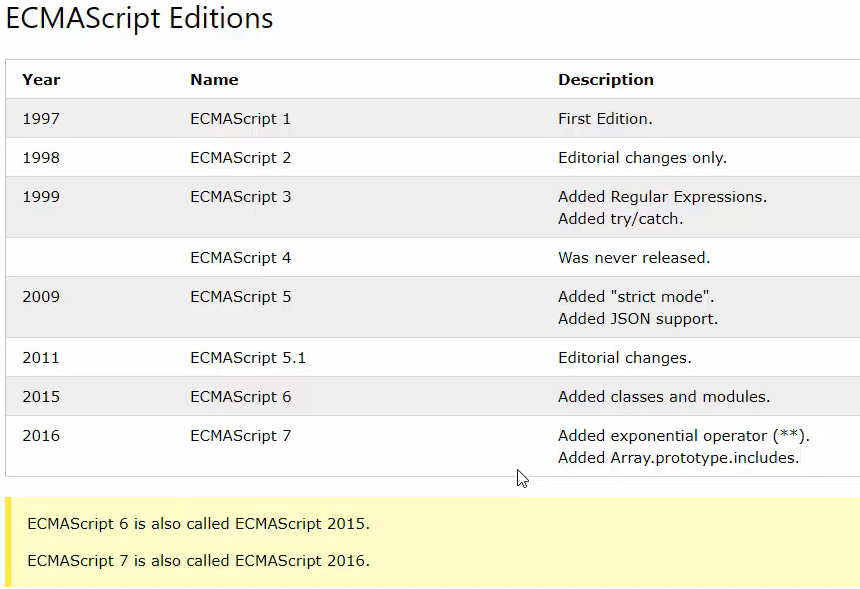
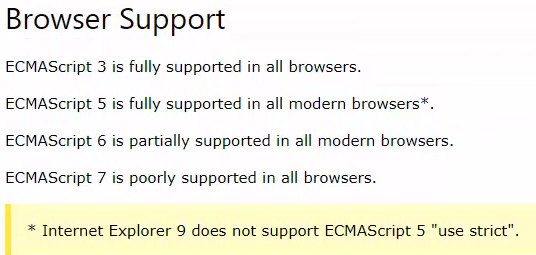

<!-- Colores
Círculo #006cb5  
Ratón #000000  
Logo #556CEE   -->
<!-- h1 h2 h3 h4
# <b>h1</b>
## <b>h2</b>
### h3
#### h4 -->

# <b>Análisis de las distintas versiones de JavaScript</b>
Todas las versiones desde ECMAScript 1 hasta el final ECMAScript 7.

La última versión, agregó elementos como operadores exponenciales, y en 2015 se agregó algo poderoso. En ECMAScript 6, agregó el concepto de clases y módulos que esencialmente permitieron que JavaScript funcionara como un objeto. lenguaje de tipo orientado.

Todo esto es muy bonito y muy útil. También es importante comprender que no todas las versiones pueden ser interpretadas por todos los navegadores.

Tienes 3, que es compatible con todos los navegadores..

5 que es compatible con todos los navegadores modernos.

Eso significa esencialmente todos los navegadores excepto algunas de las versiones anteriores de Internet Explorer..

6 está parcialmente soportado. No me he encontrado con demasiados problemas en los que el navegador no pudiera interpretar elementos como módulos y clases..

7 como se dijo, Chrome, Internet Explorer, Firefox, Opera no son compatibles, todos ellos tienen diferentes formas de poder analizar algunos de los elementos disponibles en ECMAScript 7.
# <b>Links</b>

[DevCamp Exclusivo Usuarios](https://basque.devcamp.com/pt-full-stack-development-javascript-python-react/guide/analyzing-various-versions-javascript)

[Guía de referencia de versiones](https://www.w3schools.com/js/js_versions.asp)