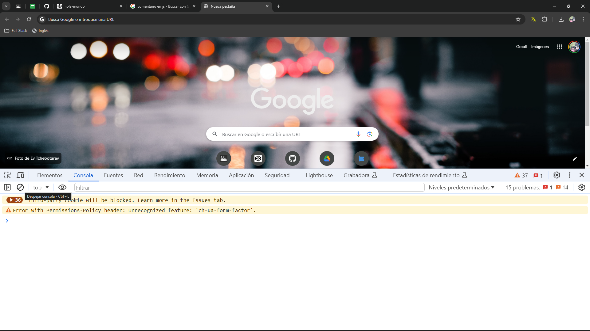
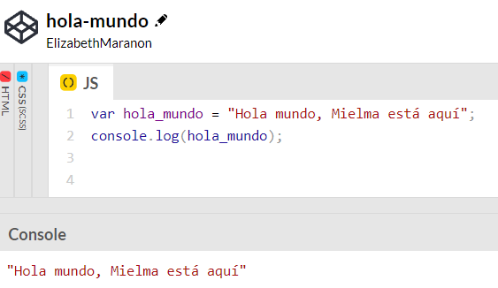

# <b>Cómo ejecutar programas JavaScript</b>
Usar CodePen para escritura JS, se puede usar desde el navegador.

## <b>Abrir Herramientas para desarrolladores</b>

Esta será su consola donde podrá ir y ejecutar el código Javascript.

Ahora, dependiendo de la página en la que lo abras, es posible que recibas algunos pequeños mensajes de error.

Despejamos consola `Control+L` o desde la consola con el botón

Crear una variable super básica
~~~
var hola_mundo = "Hola mundo, Mielma está aquí"
~~~
Pulsar enter y devuelve:
~~~
undefined
~~~
Escribe la variable creada y pulsa enter
~~~
hola_mundo
~~~
Regresa
~~~
'Hola mundo, Mielma está aquí'
~~~

Si nunca ha hecho esto antes, este es su primer fragmento de código Javascript aquí y lo ejecutamos directamente en el navegador, no tuvo que instalar nada. Puedes ir directamente a él.

Si no tienes instalado el navegador Chrome, te recomiendo que lo instales. Técnicamente puedes hacer esto en Firefox y en algunas de las versiones más modernas de Internet Explorer. Si quieres seguirlo, te recomiendo que utilices Chrome. Esto es lo que uso en cada curso de entrenamiento que tengo porque realmente me gustan las herramientas de desarrollo que ofrece y hace que sea muy agradable y fácil de construir.

Ahora la otra opción es Code Pen. Ahora Code Pen es completamente gratuito para lo que lo usaremos en este curso.

Si simplemente hace clic en Unirse a CodePen gratis, podrá escribir toda su información aquí mismo y podrá tener una cuenta gratuita.

### Ejercicio en Codepen

# <b>Links</b>

[DevCamp Exclusivo Usuarios](https://basque.devcamp.com/pt-full-stack-development-javascript-python-react/guide/how-to-run-javascript-programs)

[Codepen hola_mundo](https://codepen.io/ElizabethMaranon/pen/PovGNvp)