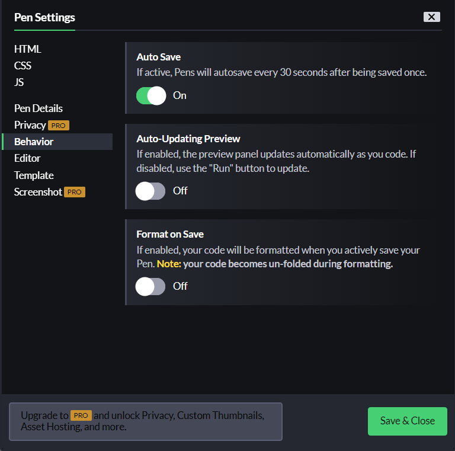
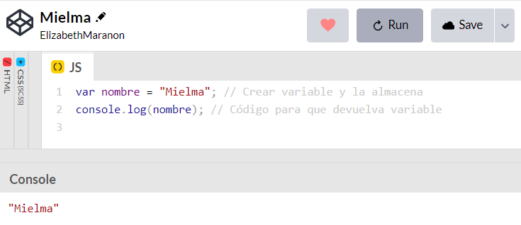
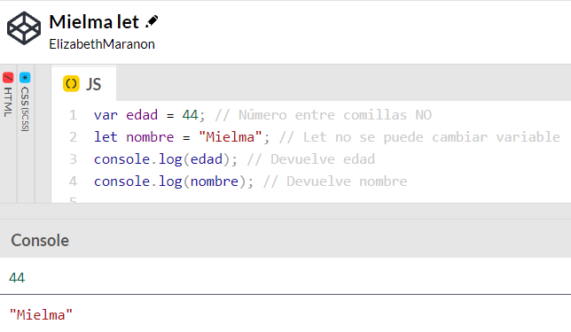

# <b><font color="#556CEE">Cómo trabajar con variables en JavaScript</font></b>
## <b><font color="#006cb5">¿Qué son las variables JS</font></b>

Las variables en la programación de computadoras son herramientas que puede utilizar para almacenar datos.

Una variable es como una instalación de almacenamiento para cualquier cosa que necesites colocar en ella.

Para poder acceder a los datos, poder almacenar algo dentro y luego llamarlo más tarde.

Cómo almacenar datos en variables, cómo definir múltiples variables al mismo tiempo y cómo usar las opciones de variables let y var.

## <b><font color="#006cb5">Cambio en configuración codepen</font></b>
Para que no se ejecute automáticamente


### <font color="#556CEE">Guardar variable</font>
<b>Importante no olvidar al finalizar ;  
String entre comillas, números no</b>

Crear la variable, enter  
```js
var nombre = "Mielma";
```
Llamarla desde la consola, enter
```js
nombre;
```

Hay que poner en el código para que devuelva en la consola y dar run para que ejecute código


Otra opción es una alerta.
Lo que hace una alerta es mostrar una pequeña ventana emergente


Se pueden poner todas las variables que se necesiten.  
Var Variable = "Var permite modificar"
Let variable = "Let <b>no</b> permite modificar"


## <b><font color="#006cb5">Coding Exercise</font></b>
Create 2 variables, called cat, and dog respectively, and set their values to something.
```js
var cat = "Brownie";
var dog = "Hades";
```

# <b><font color="#556CEE">Links🔗</font></b>

[DevCamp Exclusivo Usuarios](https://basque.devcamp.com/pt-full-stack-development-javascript-python-react/guide/how-to-work-variables-javascript)

[Codepen Mielma](https://codepen.io/ElizabethMaranon/pen/qBGaNbd)

[Codepen Mielma Alert](https://codepen.io/ElizabethMaranon/pen/yLWaJRd)

[Codepen Mielma Let](https://codepen.io/ElizabethMaranon/pen/xxNEOoR)


