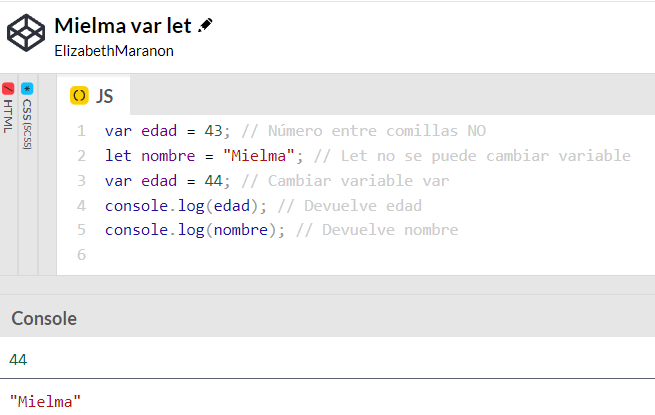
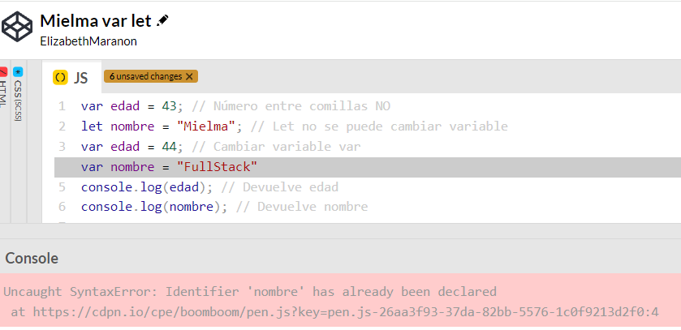
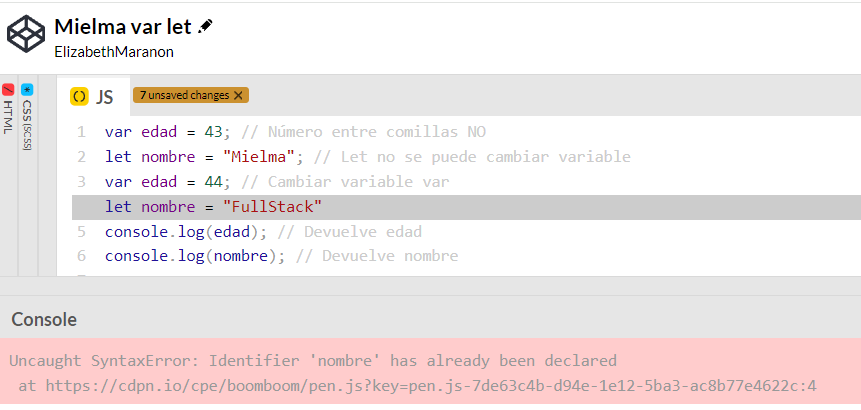

# <b>Comprender la diferencia clave entre los tipos de variables Var y Let</b>
Las variables pueden almacenarse con var o con let, conociendo sus diferencias para no crear errores
## <b>Var</b>
Var le brinda un tipo de variable muy flexible; puede considerarlo casi como un tipo de contenedor temporal. Puedes usarlo, puedes deshacerte de él. Puede reemplazarlo, anularlo, todo funciona exactamente de la forma esperada.

Las variables var se puede redefinir posteriormente sin ningún tipo de problema

Creamos las variables y modificamos una variable var, nos devuelve sin problema

## <b>Let</b>
Let ofrece un marco un poco más estricto sobre cómo redefinir las variables.

Así que siempre que quieras tener algún tipo de variable o punto de datos que no quieras anular accidentalmente, ahí es donde let Es muy útil y verás que se utilizará bastante JavaScript moderno.

Intentar cambiar una variable let por una variable var o una variable let, y nos tira error en ambas

## <b>Coding Exercise</b>
Reassign the let variable below so it equals 10
~~~
let number = 5;
~~~
Cambiar el 10 por el 5
~~~
let number = 10;
~~~

# <b>Links🔗</b>

[DevCamp Exclusivo Usuarios](https://basque.devcamp.com/pt-full-stack-development-javascript-python-react/guide/understanding-key-difference-between-var-let-variables-types)

[Código DevCamp](https://github.com/rails-camp/javascript-programming/blob/master/section_b_06_difference_var_let.js)

[Código Mielma](https://github.com/ElizabethMaranon/Full-Stack/blob/e7133eda5d145d4329d4456d0f1dbb32d524eede/JavaScript/05_Diferenciar_Var_Let_JS.js)
