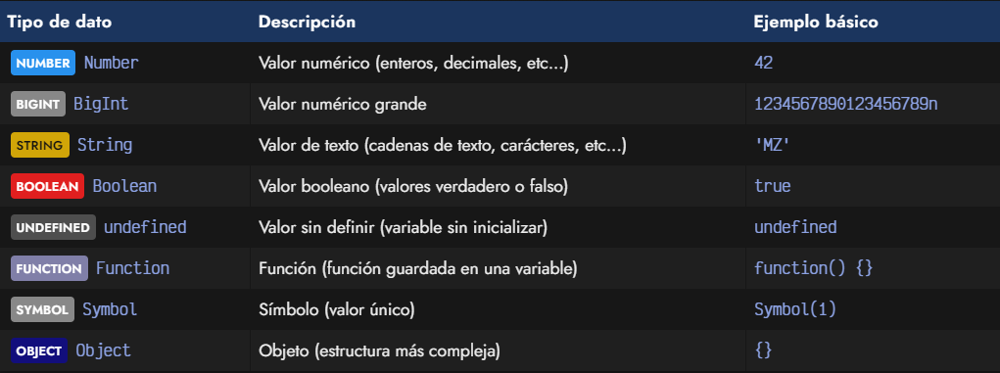
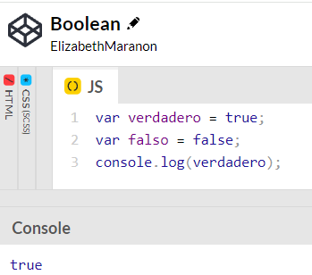
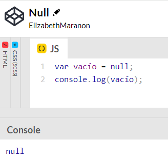
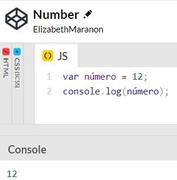
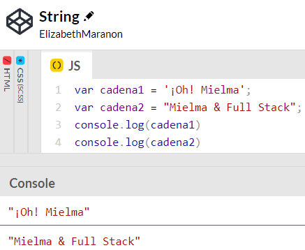
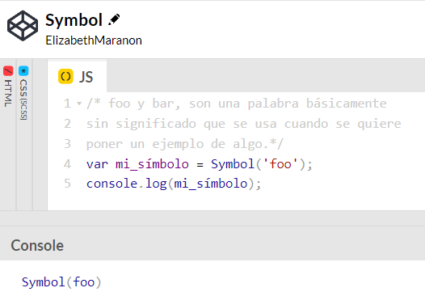

# <b><font color="#556CEE">Lista completa de tipos de datos de JavaScript</font></b>

## <b><font color="#006cb5">¿Qué son los tipos de datos?</font></b>
Un tipo de datos sirve para definir el tipo y el comportamiento de los datos: En otras palabras, con esto podemos decirle al compilador o al intérprete cómo pretendemos usar una parte de los datos. La mayoría de los lenguajes de programación admiten tipos de datos básicos como números, booleanos, cadenas, etc.

#### <font color="#006cb5">foo y bar</font>
son una palabra básicamente
sin significado que se usa cuando se quiere
poner un ejemplo de algo.

### <font color="#556CEE">[Boolean🔗](https://www.w3schools.com/js/js_booleans.asp)</font>
Muy a menudo, en programación, necesitará un tipo de datos que sólo pueda tener un de dos valores, como
```js
SÍ / NO
ENCENDIDO / APAGADO
VERDADERO / FALSO
```
Para esto, JavaScript tiene un booleano tipo de datos. Sólo puede toma los valores Verdadero o Falso.


### <font color="#556CEE">Null</font>
Null es un tipo de datos especial con un solo valor posible: null. Este valor es devuelto por una expresión que no contiene ningún valor. Desde el punto de vista de la base de datos 4D, un valor null expresa el hecho de que el valor del dato es desconocido.  
o que es nulo es la ausencia de cualquier tipo de valor



### <font color="#556CEE">Undefined</font>
Undefined: representa una variable que no ha sido declarada o a la cual no se le ha asignado un valor. 
Si una variable es declarada, pero no asignada, entonces su valor es undefined.


### <font color="#556CEE">Number</font>
Number es un objeto primitivo envolvente que permite representar y manipular valores numéricos cómo 37 o -9.25. El constructor Number contiene constantes y métodos para trabajar con números. Valores de otro tipo pueden ser convertidos a números usando la función Number().


### <font color="#556CEE">String</font>
El tipo String de JavaScript se utiliza para representar datos textuales. Es un conjunto de "elementos" de valores enteros sin signo de 16 bits. Cada elemento del String ocupa una posición en la cadena. El primer elemento está en el índice 0 , el siguiente en el índice 1 , y así sucesivamente.

Este Tipo de Dato puede tomar como valor múltiples caracteres (letras, números, símbolos, etc.) Los Strings también se conocen como Cadenas de Texto. Es lo que coloquialmente entendemos como texto escrito: Letras, signos y números que forman palabras y frases.


### <font color="#556CEE">Symbol</font>
Un símbolo es un valor primitivo único e inmutable y se puede utilizar como clave de una propiedad de objeto.

Los símbolos son un tipo de dato único en JavaScript que se pueden utilizar para crear propiedades de objetos privadas o para nombrar eventos de forma única. Se crean utilizando la función Symbol() o el método Symbol. for() y se pueden utilizar como claves en objetos o como nombres de eventos.

Los Symbols se utilizan a menudo para añadir claves de propiedades únicas a un objeto que no sean iguales a las claves que cualquier otro código pueda añadir al objeto, y que están ocultas de cualquier mecanismo que otro código utilice normalmente para acceder al objeto.



## <b><font color="#006cb5">Coding Exercise</font></b>
Assign the variable a string
```js
var string = "string"
```

# <b><font color="#556CEE">Links🔗</font></b>

[DevCamp Exclusivo Usuarios](https://basque.devcamp.com/pt-full-stack-development-javascript-python-react/guide/comprehensive-list-javascript-data-types)  

[Código DevCamp](https://github.com/rails-camp/javascript-programming/blob/master/section_b_09_data_types.js)

[Código Mielma](https://codepen.io/ElizabethMaranon/pen/rNgyYZZ)