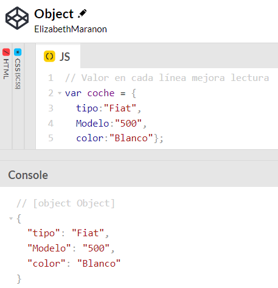
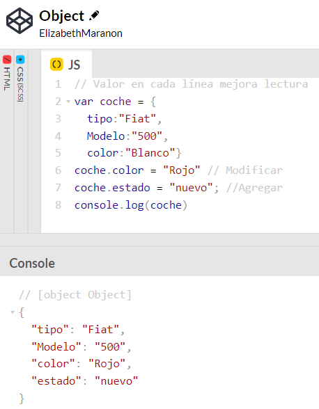

# <b>Guía de objetos JavaScript</b>

## <b>¿Qué son los [objetos🔗](https://www.w3schools.com/js/js_objects.asp) en JavaScript</b>
La clase Object representa uno de los tipos de datos en Javascript. Es usado para guardar una colección de datos definidos y entidades más complejas.

El tipo de datos de objeto le permite definir un objeto Java™ . En una definición de formato libre, especifique la palabra clave OBJECT como primera palabra clave.

En JavaScript, un objeto es un entidad independiente con propiedades y tipos. Compáralo con una taza, por ejemplo. Una taza es un objeto con propiedades. Una taza tiene un color, un diseño, un peso, un material del que está hecha, etc.

Los objetos también son variables, pueden contener muchos valores. 
Valor en cada línea mejora lectura.

Este código asigna muchos valores (Fiat, 500, blanco) a un objeto coche con nombre:

Se puede agregar o modificar los datos de los valores de los objetos

## <b>Coding Exercise</b>
update the user grades to add an english grade that is 87
~~~ 
var user = {
  name: 'Kristine',
  age: 12,
  city: 'Scottsdale',
  grades: {
    math: 90,
    science: 80,
    languageArts: 100
  }
};
~~~
~~~
user.grades.english = 87;
~~~ 

# <b>Links🔗</b>

[DevCamp Exclusivo Usuarios](https://basque.devcamp.com/pt-full-stack-development-javascript-python-react/guide/guide-javascript-objects)  

[Código DevCamp](https://github.com/rails-camp/javascript-programming/blob/master/section_b_10_objects.js)

<!-- [Código Mielma]() -->