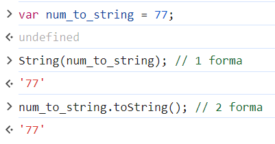
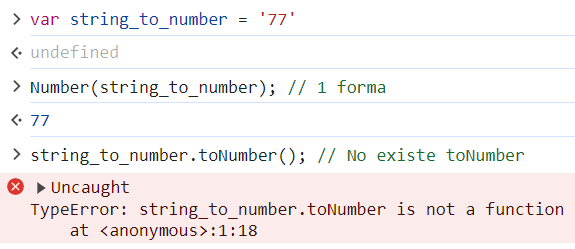
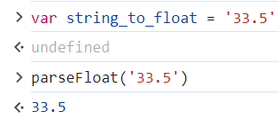
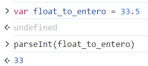
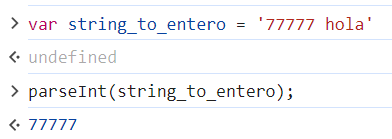
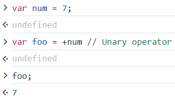
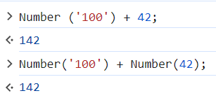

# <b>Cómo realizar conversión de tipos en JavaScript</b>

## <b>¿Qué es typecasting JS?</b>
En ciencias de la computación la conversión de tipos (type casting en inglés) se refiere a la transformación de un tipo de dato en otro. Esto se hace para tomar las ventajas que pueda ofrecer el tipo a que se va a convertir.

## <b>¿Qué es coerción en JS?</b>
La coerción en JavaScript se refiere a la conversión automática de un tipo de dato a otro tipo de dato, cuando se utilizan operaciones o comparaciones entre valores de diferentes tipos. Existen dos tipos de coerción: la coerción implícita y la coerción explícita.

### ¿Qué es coerción implícita en JS?
La coerción implícita es la que se aplica de forma automática cuando intentas ejecutar una operación con dos valores de distintos tipos. En este JavaScript intenta interpretar los valores y convertir uno de ellos al tipo de dato del otro valor, para que la operación se pueda llevar a cabo.

1. '100' - 40 = 60
     + Interpreta string cómo número 
2. '100' + 40 = 10040
    + Interpreta número cómo string
3. 100 + null = 100
    + Interpreta null cómo cero
4. '100' + null = 100null
    + Interpreta null como string

### ¿Qué es coerción explícita en JS?
En cambio, la coerción explícita es el proceso mediante el cual el programador indica explícitamente, usando ciertas funciones provistas por JavaScript, a qué tipo de dato se desea convertir un valor.
1. Coerción de número a string
    
2. Coerción de string a número
    
3. Coerción de string a punto decimal(Float)
    
4. Coerción de float o string a entero
   
   
5. Coerción unary operator(Intenta convertir el operando en un número, si aún no lo es.)
    
6. Coerción obligada a número si recibimos datos externos y no sabemos en que tipo de datos están.  
    

## <b>Coding Exercise</b>
Give myNumber a value of 12 as an integer.
Then, change it to a string, saving it to myNewString.
~~~
let myNumber = 12;

let myNewString = '12';
~~~

# <b>Links🔗</b>

[DevCamp Exclusivo Usuarios](https://basque.devcamp.com/pt-full-stack-development-javascript-python-react/guide/how-to-perform-type-casting-javascript)  

[Código DevCamp](https://github.com/rails-camp/javascript-programming/blob/master/section_b_12_type_casting.js)

<!-- [Código Mielma]() -->