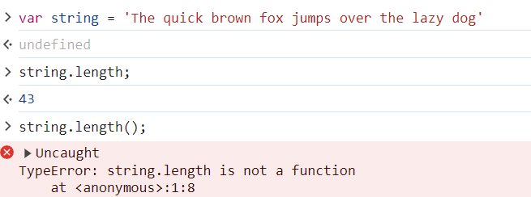

# <b>Trabajar con funciones de cadena - Parte 1</b>

## <b>¿Qué es una función[🔗](https://developer.mozilla.org/es/docs/Web/JavaScript/Guide/Functions) en JavaScript?</b>
Una función en JavaScript es similar a un procedimiento — un conjunto de instrucciones que realiza una tarea o calcula un valor, pero para que un procedimiento califique como función, debe tomar alguna entrada y devolver una salida donde hay alguna relación obvia entre la entrada y la salida.

Básicamente, una función le permite encapsular el comportamiento. En este caso, no somos nosotros quienes realmente creamos las funciones, éstas se proporcionan en la biblioteca principal de JavaScript, por lo que simplemente podemos llamarlas. Más adelante veremos cómo podemos crear nuestras propias funciones. Pero esto debería darles una pequeña introducción porque, esencialmente, lo que vamos a poder hacer es tener un objeto y luego cambiarlo o realizar ciertos tipos de consultas de valor sobre él, todo tipo de cosas..
Se necesitaría mucho código si tuviéramos que escribirlo todo a mano. Y la otra cosa buena que nos permiten hacer las funciones es realizar una tarea una y otra vez sin tener que repetir ningún código. Esa es una visión de alto nivel de lo que son las funciones.
## <b>¿Qué es index[🔗](https://developer.mozilla.org/es/docs/Web/JavaScript/Reference/Global_Objects/String/indexOf#descripci%C3%B3n) o índice en JS?</b>
Los caracteres de una cadena se indexan de izquierda a derecha. El índice del primer carácter es 0, y el índice del último carácter es - 1.

## <b>Funciones de datos</b>

### Atributo lenght[🔗](https://developer.mozilla.org/es/docs/Web/JavaScript/Reference/Global_Objects/String/length)
La propiedad length de un objeto String representa la longitud de una cadena, en unidades de código UTF-16.

Ahora, la razón por la que sé que esto es un atributo y no una función es porque si intentara poner paréntesis al final, que es lo que haría si fuera una función, llame y presione regresar, obtendrá un error. Incluso te dice que .length no es una función.

### Función .charAt()[🔗](https://developer.mozilla.org/es/docs/Web/JavaScript/Reference/Global_Objects/String/charAt)
El método charAt(`index`) de String devuelve en un nuevo String el carácter UTF-16 de una cadena.  
El valor del índice de cadena comienza desde 0 y sube hasta la longitud de la cadena menos 1 (n-1).
.png)

### Función .concat()[🔗](https://developer.mozilla.org/es/docs/Web/JavaScript/Reference/Global_Objects/String/concat)

La función concat() concatena los argumentos de tipo texto con la cadena de sobre la que se llama a la función y devuelve una nueva cadena de texto. Los cambios en la cadena original o la cadena devuelta no afectan al otro.  
¿Qué significa concatenar? Unir o enlazar dos o más cosas. Usado también como pronominal.

Añade string nuevo al final del  var string, pero no lo modifica  
Crear una nueva variable con concat si quieres guardar los cambios
.png)

### Función .includes()[🔗](https://developer.mozilla.org/es/docs/Web/JavaScript/Reference/Global_Objects/Array/includes)

El método includes() determina si una matriz incluye un determinado elemento, devuelve true o false según corresponda.

Determina si una cadena de texto puede ser encontrada dentro de otra cadena de texto, devolviendo true o false según corresponda.

<b>Diferencia mayúsculas y minúsculas</b>
.png)

### Función .startsWith()
[🔗](https://developer.mozilla.org/es/docs/Web/JavaScript/Reference/Global_Objects/String/startsWith)

El método startsWith() indica si una cadena de texto comienza con los caracteres de una cadena de texto concreta, devolviendo true o false según corresponda.
<b>Diferencia mayúsculas y minúsculas</b>
.png)

### Función .endsWith()[🔗](https://developer.mozilla.org/es/docs/Web/JavaScript/Reference/Global_Objects/String/endsWith)

El método endsWith() determina si una cadena de texto termina con los caracteres de una cadena indicada, devolviendo true o false según corresponda. (caracteres, no palabra)  
<b>Diferencia mayúsculas y minúsculas</b>
.png)

## <b>Coding Exercise</b>
Call these two functions on the provided string and have them return true. The two functions are endsWith and startsWith.
~~~
string = "Hello, what happened to all the pie?"
string.endsWith('?');
string.startsWith('Hello,')
~~~

# <b>Links🔗</b>

[DevCamp Exclusivo Usuarios](https://basque.devcamp.com/pt-full-stack-development-javascript-python-react/guide/working-string-functions-part-1)  

<!-- [Código DevCamp](https://github.com/rails-camp/javascript-programming/blob/master/section_b_13_string_functions.js) -->

<!-- [Código Mielma]() -->

[The quick brown fox jumps over the lazy dog](https://en.wikipedia.org/wiki/The_quick_brown_fox_jumps_over_the_lazy_dog)