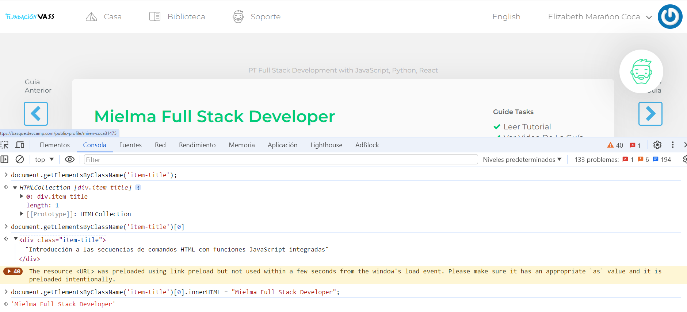

# <center><b><font color="#556CEE">Introducción a las secuencias de comandos HTML con funciones JavaScript integradas</font></b>

## <b><font color="#006cb5">¿Qué son las secuencias de comandos[🔗][def]?</font></b>

<p style="text-align: justify;">
Las secuencias de comandos permiten calcular valores, intercambiar datos entre las diversas tareas del proceso y ejecutar operaciones específicas utilizando llamadas SOAP. Las secuencias de comandos son ubicuas en los diagramas de flujo de trabajo: Todas las actividades tienen secuencias de comandos de inicialización.

## <b><font color="#006cb5">Cómo aprovechar las funciones de JavaScript integradas para modificar el contenido de un sitio web</font></b>

<p style="text-align: justify;">
Dado que javascript se procesa dentro del navegador, muchas de las funciones que proporciona también funcionan con el propio navegador.

### <font color="#556CEE">Ejercicio</font>

Inspeccionar página, desde allí se puede ver los datos que tiene el documento y acceder a la consola y tener acceso a todo el código.

`document` consulta todo el código
```js
#document (https://basque.devcamp.com/pt-full-stack-development-javascript-python-react/guide/introduction-html-scripting-built-javascript-functions)<!DOCTYPE html><html>​<head>​…​</head>​<body>​…​</body>​</html>​
```

`document.getElementsByClassName('item-title')` Consulta el código con clase 'item-title' y te devuelve un objeto y en el se pueden ver toda clase de atributos
```js
HTMLCollection [div.item-title]
0: div.item-title
length: 1
[[Prototype]]: HTMLCollection
```
`document.getElementsByClassName('item-title')[0]` El número selecciona el primero, ya que empieza a contar desde 0
```js
<div class="item-title">Introducción a las secuencias de comandos HTML con funciones JavaScript integradas</div>
```
`document.getElementsByClassName('item-title')[0].innerHTML = "Mielma Full Stack Developer"` Con inner HTML cambiamos la variable temporalmente
```
'Mielma Full Stack Developer'
```


<p style="text-align: justify;">
Es muy útil cuando creamos programas que necesitan cambiar su contenido sobre la marcha.


<p style="text-align: justify;">
<!-- ## <center><b><font color="#006cb5">Coding Exercise</font></b>
```js
```
Resultado:
```js
``` -->


# <center><b><font color="#556CEE">🔗Links🔗</font></b>

[DevCamp Exclusivo Usuarios](https://basque.devcamp.com/pt-full-stack-development-javascript-python-react/guide/introduction-html-scripting-built-javascript-functions)  

[Código DevCamp](https://github.com/rails-camp/javascript-programming/blob/master/section_d_97_built_in_functions.js)

<!-- [Código Mielma]() -->

[def]: https://experienceleague.adobe.com/es/docs/campaign-classic/using/automating-with-workflows/advanced-management/javascript-scripts-and-templates#access_token=eyJhbGciOiJSUzI1NiIsIng1dSI6Imltc19uYTEta2V5LWF0LTEuY2VyIiwia2lkIjoiaW1zX25hMS1rZXktYXQtMSIsIml0dCI6ImF0In0.eyJpZCI6IjE3MTc4Njk4NTU0ODRfMzRmMDY3ZDEtYzkwMy00ZDFlLThhMjUtYmRhNjk4NjNiZjc1X3ZhNmMyIiwidHlwZSI6ImFjY2Vzc190b2tlbiIsImNsaWVudF9pZCI6IkV4cGVyaWVuY2VMZWFndWUiLCJ1c2VyX2lkIjoiRUJBRjFFMjg2NUUwQ0VCMTBBNDk1RUY2QEFkb2JlSUQiLCJzdGF0ZSI6IntcInNlc3Npb25cIjpcImh0dHBzOi8vaW1zLW5hMS5hZG9iZWxvZ2luLmNvbS9pbXMvc2Vzc2lvbi92MS9ZMkV6WlRaaE1EZ3RZamhoWlMwME5XSTBMV0kwTldVdFl6SmpZMll3TldRelpEYzNMUzFGUWtGR01VVXlPRFkxUlRCRFJVSXhNRUUwT1RWRlJqWkFRV1J2WW1WSlJBXCJ9IiwiYXMiOiJpbXMtbmExIiwiYWFfaWQiOiJFQkFGMUUyODY1RTBDRUIxMEE0OTVFRjZAQWRvYmVJRCIsImN0cCI6MCwiZmciOiJZUVBWV0JBMlZQUDVNSFVLRk1RVllIQUFDQSIsInNpZCI6IjE3MDkyMzE3OTYyMzhfYWQwYTFkMDctNDFkOC00NTA2LTkyM2ItY2UyNTkwMmY0ZGZhX3ZhNmMyIiwibW9pIjoiZWYzZmMzZWYiLCJwYmEiOiJNZWRTZWNOb0VWLExvd1NlYyIsImV4cGlyZXNfaW4iOiI4NjQwMDAwMCIsImNyZWF0ZWRfYXQiOiIxNzE3ODY5ODU1NDg0Iiwic2NvcGUiOiJBZG9iZUlELGFkZGl0aW9uYWxfaW5mby5jb21wYW55LGFkZGl0aW9uYWxfaW5mby5vd25lck9yZyxhdmF0YXIsb3BlbmlkLHJlYWRfb3JnYW5pemF0aW9ucyxyZWFkX3BjLHNlc3Npb24sYWNjb3VudF9jbHVzdGVyLnJlYWQscHBzLnJlYWQifQ.d0pA7edmXx08MhO8uxzNeOamxXGAyyStB2NrH0ZQwX-Jb_zBAtp-Km-pVB17pliJHvrmrM4WugcSAy8WaobiREtcB7V7asxsT23WIMUVUFGOHkv3yWWMqJQZIBjhjWpjU9iDm18luwkFD6avLTW6V1j-Gs7OCMQVV_Z2Do6zUZAAeJpT_06PdRMWnvdaSk2hMHPKWytg_sOoT8m3lcXkOh1Q_OScuNMkJDO2Qm2mS_Nry_4wYODEg9hgkWHdvUOOsuEhvBYG67kFACoA_jG4fWRgUS6tDaCUB1n_QeK8-urMCUCm8IalP-T0sgkyZm-LC5F1XKtyuA51sbyk960TEA&token_type=bearer&expires_in=86399996