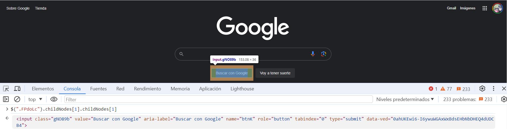

# <center><b><font color="#556CEE">Ejecutar consultas de búsqueda de Google en JavaScript</font></b>
Inspeccionar la barra de búsqueda en [google.es](https://www.google.es/)
Ahora lo que esto me dice es que me cuenta algunos detalles sobre el input element. Afortunadamente este elemento tiene un class en un ID. Esas son dos cosas que podríamos usar y con las que podríamos trabajar. Eso es lo primero que sé que necesitamos y esta será la parte fácil: establecer el texto. Luego, más adelante veremos cómo podemos hacer clic en el botón.
```js
<textarea class="gLFyf" aria-controls="Alh6id" aria-owns="Alh6id" autofocus="" title="Buscar" value="" jsaction="paste:puy29d;" aria-label="Buscar" aria-autocomplete="both" aria-expanded="false" aria-haspopup="false" autocapitalize="off" autocomplete="off" autocorrect="off" id="APjFqb" maxlength="2048" name="q" role="combobox" rows="1" spellcheck="false" data-ved="0ahUKEwi6-I6ywuWGAxWxBdsEHbNbDHEQ39UDCA4"></textarea>
```
![Search Inspect][Search Inspect]

Primero, asegurémonos de tener un `script` para poder hacer esto. Voy a usar la clase, pero también podríamos usar el ID. La única diferencia es que recuerde que una identificación solo se puede colocar en un lugar de la página y una clase puede colocar tantas clases como desee..

En este caso específico, no importa porque sé que solo hay uno de estos en la página. Así que haré clic aquí y les mostraré dos formas en las que pueden usar un `selector` dentro de un navegador.

La primera es utilizar este `$` sintaxis donde digo `$` y luego, entre paréntesis, pongo una cita y luego puedo simplemente pegar el nombre de clase que tomamos. Ahora, si termino eso y presiono Enter, puedes ver que devuelve todo `DOM node`, cual es este `input element` justo ahí.
![Search Ver Consola][Search Ver Consola]

Eso está perfectamente bien. Ahora, la otra forma de hacerlo es escribiendo Javascript puro. Entonces podría decir algo como:
```js
const searchBar = document.querySelector('.gLFyf')
```

En este caso, sólo quiero tomar uno para poder decir querySelector y no querySelectorAll. Luego use exactamente la misma sintaxis y dirá undefined, pero luego, si encuentro mi barra de búsqueda, puedes ver que devuelve exactamente el mismo valor.
![Search variable][Search variable]

Entonces, todo lo que hicimos con esa primera sintaxis se puede lograr en Javascript normal. Ahora, la diferencia clave aquí es que si estás desarrollando pruebas de un fragmento de código javascript real, algo que vas a colocar en un archivo javascript, entonces debes seguir esta sintaxis..

Si simplemente desea automatizar algo en el navegador, puede utilizar esto. Esto le brinda una API realmente agradable y sencilla para simplemente tomar elementos y luego trabajar con ellos. En este video voy a usar esta sintaxis y luego, en videos futuros, les mostraré cómo usar la otra..

Déjame borrar esto y puedes borrarlo presionando control + l. Ahora lo que quiero hacer es establecer el valor, así que diré: esta clase y luego diré:
```js
$('.gLFyf').value = ''
```
Entonces solo tengamos una string. Diré que quiero buscar sugerencias de JavaScript como esta.:
```js
$('.gLFyf').value = 'JavaScript tips'
```
Puedes verlo aquí arriba. Ahora dice consejos de javascript.
![Search Escribir][Search Escribir]

`Dom Node`

![Search Boton][Search Boton]
Atravesar `Dom Node`  
`FPdoLc class element`
```js
$('.FPdoLc')
```
![Search Boton Consola][Search Boton Consola]

Por eso queremos obtener sólo este botón de búsqueda de Google. Si hace clic aquí, podrá ver que el botón está dentro de `center`, y ahí es donde podemos encontrarlo. Así que lo que voy a hacer ahora es golpear `up.` puedo decir: `$('.FPdoLc')`, y ahora se llama la función que quiero ejecutar `childNodes`.

Lo que esto le dice a JavaScript y lo que hace en el navegador es que dice: "está bien, gracias por traerme este `FPdoLc` aquí, pero en realidad estoy interesado en lo que hay dentro. Estoy interesado en lo que está anidado allí". Ahora si hago clic en eso, puedes ver que devuelve un `NodeList`, y esta NodeList tiene un solo elemento llamado `center`.
Buscamos childNodes
```js
$('.FPdoLc').childNodes
```
![Search Boton Nodes][Search Boton Nodes]

Accedemos a center
```js
$(".FPdoLc").childNodes[1]
```
![Search Boton Nodes 1][Search Boton Nodes 1]

Buscamos childNodes
![Search Boton Nodes 1 Nodes][Search Boton Nodes 1 Nodes]
Accedemos a input


Accedemos a click()
```js
$(".FPdoLc").childNodes[1].childNodes[1].click()
```
Código resumen
```js
// Escribir en el recuadro de búsqueda
$('.gLFyf').value = "Javascript tips";
// Click botón buscar
$(".FPdoLc").childNodes[1].childNodes[1].click()
```
![Search Boton Nodes 1 Nodes 1 Click()][Search Boton Nodes 1 Nodes 1 Click()]


## <center><b><font color="#006cb5">Coding Exercise</font></b>
Use the querySelector to grab the div with the class name "target"
```html
<div class="parent">
    <div class="decoy"></div>
    <div class="decoy"></div>
    <div class="target">You got this!</div>
    <div class="decoy"></div>
</div>
```
```js
var query = deleteThisAndReplaceWithYourCode
```
Resultado:
```js
var query = document.querySelector('.target')
```

# <center><b><font color="#556CEE">🔗Links🔗</font></b>

[DevCamp Exclusivo Usuarios](https://basque.devcamp.com/pt-full-stack-development-javascript-python-react/guide/running-google-search-queries-javascript)  


<!-- Ordenar enlaces -->

[Search Inspect]: image/Search_inspect.png

[Search Ver Consola]:image/Search_Ver_Consola.png

[Search variable]: image/Search_variable.png

[Search Escribir]: image/search_escribir.png

[Search Boton]: image/Search_Boton.png

[Search Boton Consola]: image/Search_Boton_Consola.png

[Search Boton Nodes]: image/Search_Boton_Nodes.png

[Search Boton Nodes 1]: image/Search_Boton_Nodes_1.png

[Search Boton Nodes 1 Nodes]: image/Search_Boton_Nodes_1_Nodes.png

[Search Boton Nodes 1 Nodes 1 Click()]: image/Search_Boton_Nodes_1_Nodes_1_click.png

