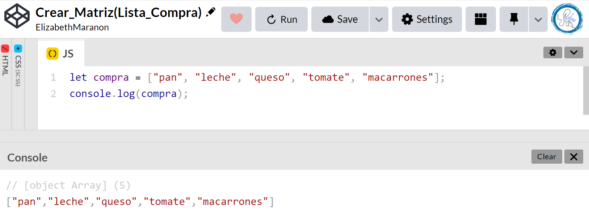
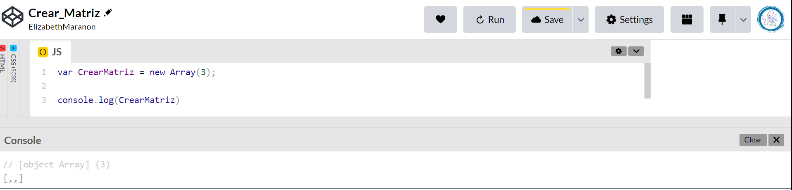

# <center><b><font color="#556CEE">Cómo crear matrices en JavaScript</font></b>

## <b><font color="#006cb5">Creando una matriz[🔗](https://developer.mozilla.org/es/docs/Learn/JavaScript/First_steps/Arrays#creando_un_arreglo)</font></b>

Las matrices se construyen con corchetes, que contiene una lista de elementos separados por comas.

1. Digamos que queríamos almacenar una lista de compras en un matriz → haríamos algo como lo siguiente.  Ingresa las siguientes líneas en la consola:
    ```js
    let compra = ["pan", "leche", "queso", "tomate", "macarrones"];
    compra;
    ```
    
2. En este caso, cada elemento de la matriz es una cadena, pero ten en cuenta que puedes almacenar cualquier elemento en una matriz — cadena, número, objeto, otra variable, incluso otro matriz. También puedes mezclar y combinar tipos de elementos — no todos tienen que ser números, cadenas, etc. Prueba estos:
    ```js
    let sequence = [1, 1, 2, 3, 5, 8, 13];
    let random = ["tree", 795, [0, 1, 2]];
    ```
    


## <b><font color="#006cb5">Hay dos formas principales de crear una matriz</font></b>

### <font color="#556CEE">La primera sintaxis</font>
Es una sintaxis generada donde creamos un nuevo objeto de matriz. Se usa generalmente cuando no se sabe cuales son los valores pero si cuantos elementos hay.
1. Almacenar en una variable `CrearMatriz`, sintaxis `new`, luego una matriz y cantidad de elementos. Se creará la matriz
    ```js
    var CrearMatriz = new Array(3);
    ```
    Tenemos 3 elementos no definidos
    

2. Crear matriz, en este caso de tres string
   ```js
   var CrearMatriz = new Array ('Mielma', 'Eli', 'Marañón')
   ```    


<!-- ### <font color="#556CEE">H3</font> -->
<!-- #### <font color="#006cb5">H4</font> -->

## <b><font color="#006cb5">Ejercicio</font></b>

<!-- ## <center><b><font color="#006cb5">Coding Exercise</font></b>
```js
```
Resultado:
```js
``` -->

# <center><b><font color="#556CEE">🔗Links🔗</font></b>

[DevCamp Exclusivo Usuarios](https://basque.devcamp.com/pt-full-stack-development-javascript-python-react/guide/how-to-create-arrays-javascript)  

<!-- [Código DevCamp]() -->

<!-- [Código Mielma]() -->

[Creando una matriz](https://developer.mozilla.org/es/docs/Learn/JavaScript/First_steps/Arrays#creando_un_arreglo)