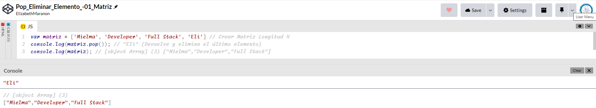

# <center><b><font color="#556CEE">Guía para agregar y eliminar elementos de matriz en JavaScript</font></b>

## <b><font color="#006cb5">pop[🔗](https://developer.mozilla.org/es/docs/Web/JavaScript/Reference/Global_Objects/Array/pop#descripci%C3%B3n)</font></b>
El método pop() elimina el último elemento de un array y lo devuelve. Este método cambia la longitud del array.

### <font color="#556CEE">Sintaxis</font>
```js
matriz.pop()
```
#### <font color="#006cb5">Valor devuelto</font>
El elemento que ha sido eliminado del array; `undefined` si el array está vacío.

### <font color="#556CEE">Descripción</font>
El método `pop` elimina el último elemento de un array y devuelve su valor al método que lo llamó.

`pop` es intencionadamente genérico; este método puede ser called o applied en objectos similares a un array. En objetos que no contengan una propiedad `length`, que refleje su forma en una serie de propiedades numéricas consecutivas en base cero, puede no comportarse de manera significativa.

Si se llama a `pop()` en un array vacío, devuelve `undefined`.

### <font color="#556CEE">Ejemplo</font>
```js
var matriz = ['Mielma', 'Developer', 'Full Stack', 'Eli'] // Crear Matriz
console.log(matriz.length); // Longitud 4
console.log(matriz.pop()); // Devuelve y elimina el último elemento
console.log(matriz); // ["Mielma","Developer","Full Stack"]
```


## <b><font color="#006cb5">push[🔗](https://developer.mozilla.org/es/docs/Web/JavaScript/Reference/Global_Objects/Array/push)</font></b>
El método `push()` añade uno o más elementos al final de un array y devuelve la nueva longitud del array.
### <font color="#556CEE">Sintaxis</font>```js
matriz.push()

## <b><font color="#006cb5">Ejercicio</font></b>
<!-- ### <font color="#556CEE">H3</font> -->
<!-- #### <font color="#006cb5">H4</font> -->
<!-- ## <center><b><font color="#006cb5">Coding Exercise</font></b>
```js
```
Resultado:
```js
``` -->

# <center><b><font color="#556CEE">🔗Links🔗</font></b>

[DevCamp Exclusivo Usuarios]()  

<!-- [Código DevCamp]() -->

<!-- [Código Mielma]() -->