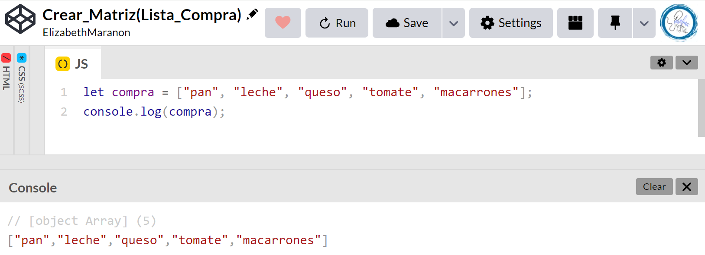
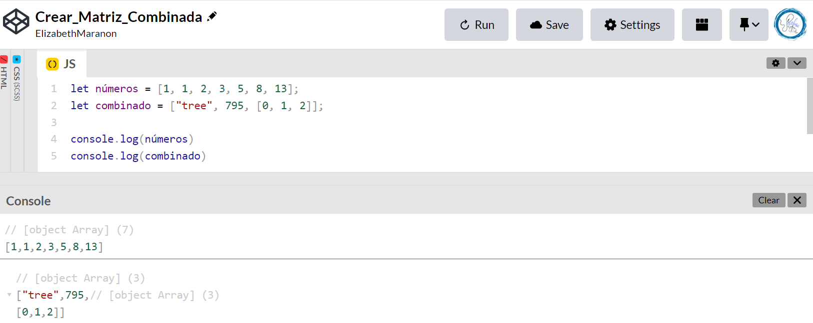
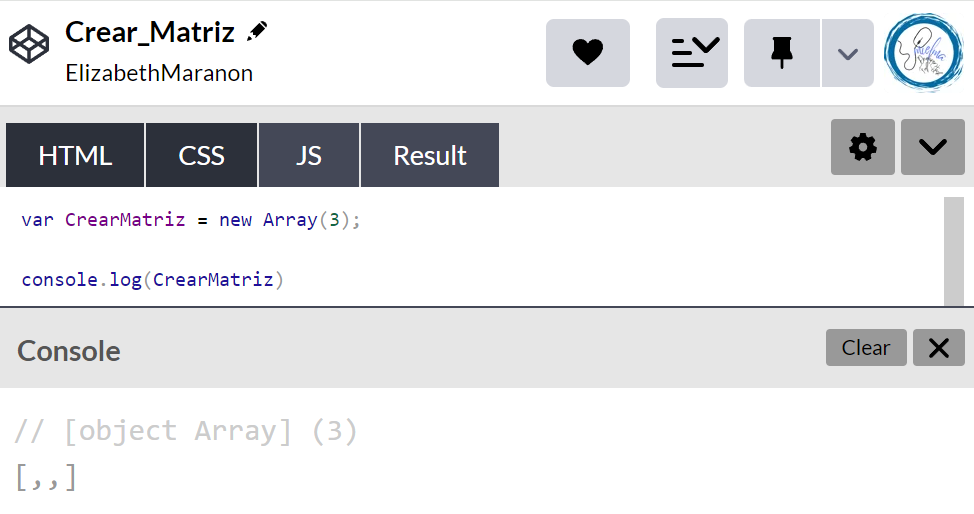
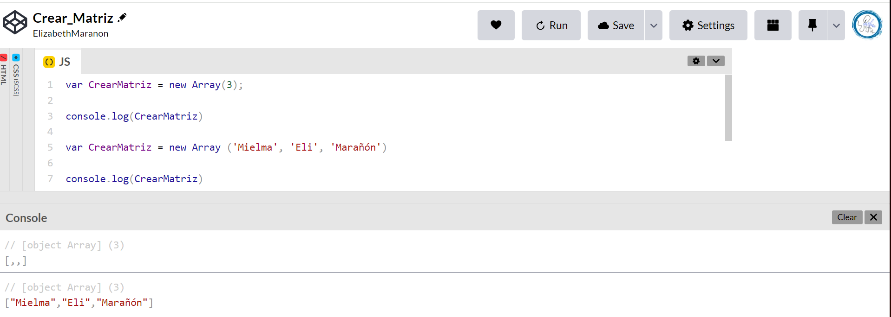
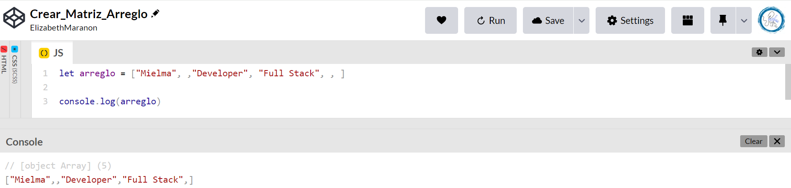
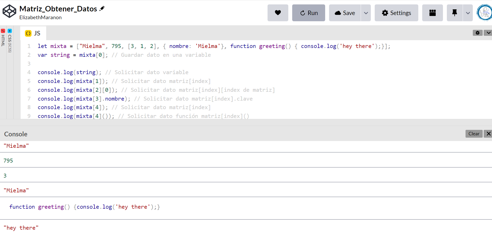

# <center><b><font color="#556CEE">Cómo crear matrices en JavaScript</font></b>

## <b><font color="#006cb5">Creando una matriz[🔗](https://developer.mozilla.org/es/docs/Learn/JavaScript/First_steps/Arrays#creando_un_arreglo)</font></b>

Las matrices se construyen con corchetes, que contiene una lista de elementos separados por comas.

1. Digamos que queríamos almacenar una lista de compras en un matriz → haríamos algo como lo siguiente.  Ingresa las siguientes líneas en la consola:
    ```js
    let compra = ["pan", "leche", "queso", "tomate", "macarrones"];
    compra;
    ```
    
2. En este caso, cada elemento de la matriz es una cadena, pero ten en cuenta que puedes almacenar cualquier elemento en una matriz — cadena, número, objeto, otra variable, incluso otro matriz. También puedes mezclar y combinar tipos de elementos — no todos tienen que ser números, cadenas, etc. Prueba estos:
    ```js
    let sequence = [1, 1, 2, 3, 5, 8, 13];
    let random = ["tree", 795, [0, 1, 2]];
    ```
    


## <b><font color="#006cb5">Hay dos formas principales de crear una matriz</font></b>

### <font color="#556CEE">Primera sintaxis →→ Crear nuevo objeto</font> 
Se usa generalmente cuando no se sabe cuales son los valores pero si cuantos elementos hay.
1. Almacenar en una variable `CrearMatriz`, sintaxis `new`, luego una matriz y cantidad de elementos. Se creará la matriz
    ```js
    var CrearMatriz = new Array(3);
    ```
    Tenemos 3 elementos no definidos
    

2. Crear matriz, en este caso de tres string
   ```js
   var CrearMatriz = new Array ('Mielma', 'Eli', 'Marañón')
   ```    


### <font color="#556CEE">Segunda sintaxis → Arreglos literales / Array literals </font> 
En JavaScript, los arreglos pueden ser una colección de elementos de cualquier tipo. Esto significa que tú puedes crear un arreglo con elementos de tipo Cadena , Boolean, Número, Objetos, e incluso otros Arreglos.

Un arreglo literal es una lista de cero o más expresiones, cada una de las cuales representa un elemento del arreglo, encerrada entre corchetes `[elementos, separados, por, comas, indistintamente, del, tipo]`. 

Cuando creas un arreglo utilizando un arreglo literal, se inicia con los valores especificados como sus elementos, y su `length` se establece en el número de argumentos especificado.

#### <font color="#006cb5">Ejemplo</font>
Comas adicionales en arreglos literales, No tienes que especificar todos los elementos en un arreglo literal. Si colocas dos comas en una fila, el arreglo completa el valor undefined para los elementos no especificados. Si incluyes una coma al final de la lista de los elementos, la coma es ignorada. ❗**Solo se ignora la última coma.**

Crear arreglo con tres nombres y `length` de cuatro., ya que `, ,`es un elemento pero está vacío.
```js
let arreglo = ["Mielma", , "Developer", "Full Stack", , ]
```

Si creas un arreglo utilizando un literal en un script de nivel superior, JavaScript interpreta el arreglo cada vez que evalúa la expresión que contiene el arreglo literal. Además, cada vez que llamas a una función se crea un literal usado en ella.

Entender el comportamiento de las comas adicionales es importante para comprender JavaScript como lenguaje.

Sin embargo, al escribir tu propio código, debes declarar explícitamente los elementos que faltan como undefined. Hacerlo así aumenta la claridad y la facilidad de mantenimiento de tu código.

## <b><font color="#006cb5">Obtener datos de las matrices</font></b>
Se pueden obtener los datos de las matrices poniendo el index entre corchetes

```js
let mixta = ["Mielma", 795, [3, 1, 2], { nombre: 'Mielma'}, function greeting() { console.log('hey there');}];
var string = mixta[0]; // Guardar dato en una variable
// Solicitar dato variable
console.log(string); 
// Solicitar dato matriz[index]
console.log(mixta[1]); 
// Solicitar dato matriz[index][index de matriz]
console.log(mixta[2][0]); 
// Solicitar dato matriz[index].clave
console.log(mixta[3].nombre);
// Solicitar dato matriz[index]
console.log(mixta[4]); 
// Solicitar dato función matriz[index]()
console.log(mixta[4]()); 
```



<!-- ### <font color="#556CEE">H3</font> -->
<!-- #### <font color="#006cb5">H4</font> -->

## <b><font color="#006cb5">Ejercicio</font></b>
1. Crear matriz String
   ```js
   let string = ["Mielma","Developer", "Full Stack"]
   ```
2. Crear Matriz Number
    ```js
    let number = [1, 1, 2, 3, 5, 8, 13];
    ```
3. Crear Matriz Mixta
   ```js
   let mixta = ["tree", 795, [0, 1, 2], { nombre: 'Mielma'}, function hola() { console.log('Hola, soy Mielma');}];
   ```
   


## <center><b><font color="#006cb5">Coding Exercise</font></b>
Create an array that has 3 elements, there must be a least one number within the array.
```js
var myArray = []
```
Resultado:
```js
var myArray = ['Mielma', 44, ['Full Stack', 'Developer']]
```

# <center><b><font color="#556CEE">🔗Links🔗</font></b>

[DevCamp Exclusivo Usuarios](https://basque.devcamp.com/pt-full-stack-development-javascript-python-react/guide/how-to-create-arrays-javascript)  

[Código DevCamp](https://github.com/rails-camp/javascript-programming/blob/master/section_e__01_introduction_arrays.js)

[Creando una matriz](https://developer.mozilla.org/es/docs/Learn/JavaScript/First_steps/Arrays#creando_un_arreglo)