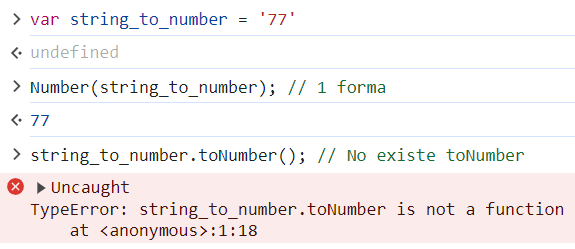
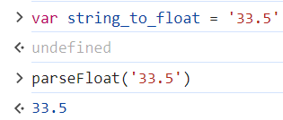
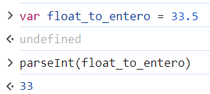
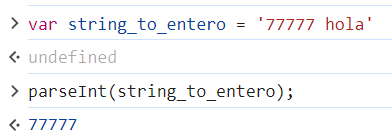
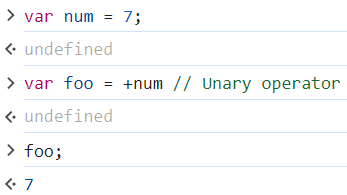
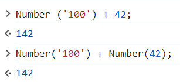

# <b><font color="#556CEE">Cómo realizar conversión de tipos en JavaScript</font></b>

## <b><font color="#006cb5">¿Qué es typecasting JS?</font></b>
En ciencias de la computación la conversión de tipos (type casting en inglés) se refiere a la transformación de un tipo de dato en otro. Esto se hace para tomar las ventajas que pueda ofrecer el tipo a que se va a convertir.

## <b><font color="#006cb5">¿Qué es coerción en JS?</font></b>
La coerción en JavaScript se refiere a la conversión automática de un tipo de dato a otro tipo de dato, cuando se utilizan operaciones o comparaciones entre valores de diferentes tipos. Existen dos tipos de coerción: la coerción implícita y la coerción explícita.

### <font color="#556CEE">¿Qué es coerción implícita en JS?</font>
La coerción implícita es la que se aplica de forma automática cuando intentas ejecutar una operación con dos valores de distintos tipos. En este JavaScript intenta interpretar los valores y convertir uno de ellos al tipo de dato del otro valor, para que la operación se pueda llevar a cabo.

1. '100' - 40 = 60
     + Interpreta string cómo número 
2. '100' + 40 = 10040
    + Interpreta número cómo string
3. 100 + null = 100
    + Interpreta null cómo cero
4. '100' + null = 100null
    + Interpreta null como string

### <font color="#556CEE">¿Qué es coerción explícita en JS?</font>
En cambio, la coerción explícita es el proceso mediante el cual el programador indica explícitamente, usando ciertas funciones provistas por JavaScript, a qué tipo de dato se desea convertir un valor.
1. Coerción de número a string
    
2. Coerción de string a número
    
3. Coerción de string a punto decimal(Float)
    
4. Coerción de float o string a entero
   
   
5. Coerción unary operator(Intenta convertir el operando en un número, si aún no lo es.)
    
6. Coerción obligada a número si recibimos datos externos y no sabemos en que tipo de datos están.  
    


## <b><font color="#006cb5">Coding Exercise</font></b>
Give myNumber a value of 12 as an integer.
Then, change it to a string, saving it to myNewString.
```js
let myNumber = 12;

let myNewString = '12';
```

# <b><font color="#556CEE">Links🔗</font></b>

[DevCamp Exclusivo Usuarios](https://basque.devcamp.com/pt-full-stack-development-javascript-python-react/guide/how-to-perform-type-casting-javascript)  

[Código DevCamp](https://github.com/rails-camp/javascript-programming/blob/master/section_b_12_type_casting.js)

<!-- [Código Mielma]() -->